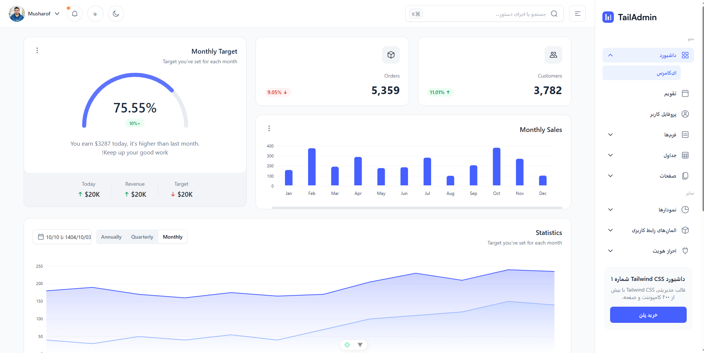
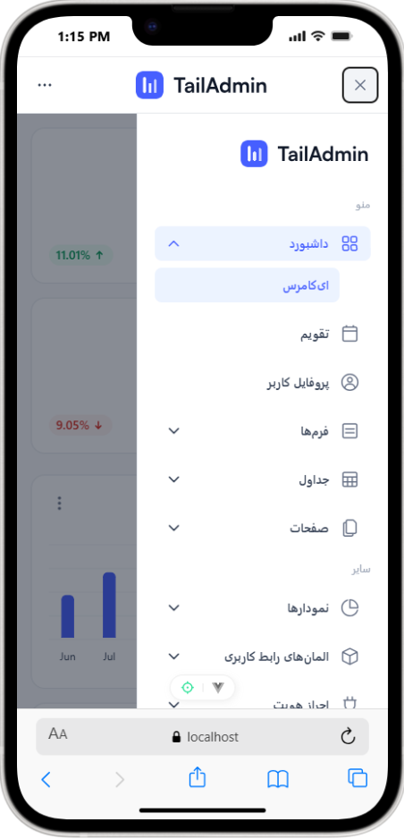

# TailAdmin Vue RTL (FA/EN) - Responsive Admin Dashboard with Jalali Calendar
# TailAdmin Vue راست به چپ (فارسی/انگلیسی) - داشبورد ادمین ریسپانسیو با تقویم جلالی

## Overview | معرفی
| English | فارسی |
| --- | --- |
| Open-source TailAdmin Vue fork with full English/Persian i18n, RTL-first Persian UX, and a Jalali (Shamsi) calendar. Built for production use and easy customization. | نسخه اپن سورس TailAdmin Vue با پشتیبانی کامل دو زبانه فارسی/انگلیسی، تجربه RTL استاندارد، و تقویم جلالی. مناسب استفاده عملی و سفارشی سازی سریع. |

## Features | ویژگی ها
| English | فارسی |
| --- | --- |
| - Runtime language switch with persistence - Full RTL layout (sidebar, header, menus, forms, tables, notifications, charts) - Jalali calendar + localized date/time pickers - Persian typography (Vazirmatn) with easy font swap - Locale-aware numbers and date/time formatting (Intl) - Fully responsive across desktop, tablet, and mobile | - تغییر زبان در لحظه با ذخیره شدن انتخاب - RTL کامل برای همه بخش ها (منو، هدر، فرم، جدول، اعلان، نمودار) - تقویم جلالی و ورودی تاریخ/ساعت بومی - تایپوگرافی فارسی (Vazirmatn) با امکان تغییر ساده فونت - اعداد و تاریخ/زمان متناسب با زبان (Intl) - ریسپانسیو کامل در همه اندازه ها |

## Tech Stack | تکنولوژی ها
| English | فارسی |
| --- | --- |
| Vue 3, Vite, TypeScript, Tailwind CSS v4, vue-router, vue-i18n, FullCalendar, flatpickr (Jalali), ApexCharts | Vue 3، Vite، TypeScript، Tailwind CSS نسخه 4، vue-router، vue-i18n، FullCalendar، flatpickr جلالی، ApexCharts |

## Demo | دمو
| English | فارسی |
| --- | --- |
| English demo only: https://demo.tailadmin.com | دموی فعلا فقط انگلیسی: https://demo.tailadmin.com |

## Screenshots | اسکرین شات ها
| English | فارسی |
| --- | --- |
| Desktop Dashboard (FA) | داشبورد دسکتاپ (فارسی) |
|  |  |
| Tablet Dashboard (FA) | داشبورد تبلت (فارسی) |
|  |  |
| Mobile Menu (FA) | منوی موبایل (فارسی) |
|  |  |
| Calendar (FA) | تقویم (فارسی) |
|  |  |

## Getting Started | راه اندازی
| English | فارسی |
| --- | --- |
| 1) Install dependencies: `npm install` 2) Start dev server: `npm run dev` 3) Build: `npm run build` | 1) نصب وابستگی ها: `npm install` 2) اجرای توسعه: `npm run dev` 3) بیلد نهایی: `npm run build` |

## Prerequisites | پیش نیازها
| English | فارسی |
| --- | --- |
| - Node.js 18+ (recommended 20+) - Recommended IDE: VSCode + Volar (disable Vetur) | - Node.js نسخه 18 یا بالاتر (پیشنهادی 20+) - IDE پیشنهادی: VSCode + Volar (غیرفعال کردن Vetur) |

## Type Support | پشتیبانی TypeScript
| English | فارسی |
| --- | --- |
| TypeScript needs `vue-tsc` for `.vue` typing. Use the provided `npm run type-check` and make sure Volar is enabled. | برای تایپ های `.vue` از `vue-tsc` استفاده شده است. از `npm run type-check` استفاده کنید و Volar فعال باشد. |

## Usage & Configuration | نحوه استفاده و کانفیگ
| English | فارسی |
| --- | --- |
| - Change default locale and supported languages in `src/locales/index.ts`. - Add a new language: create `src/locales/<lang>` and add JSON namespaces, then update `SUPPORTED_LOCALES`. - RTL/LTR is set in `setLocale()` by updating `html[dir]` and `html[lang]` (`src/locales/index.ts`). - Persian font stack is defined in `src/assets/main.css` (`--font-vazirmatn` + `html[lang='fa']`). - Jalali calendar UI lives in `src/components/calendar/JalaliCalendar.vue` and date pickers use `src/utils/flatpickr.ts`. | - تغییر زبان پیش فرض و زبان های پشتیبانی شده در `src/locales/index.ts`. - افزودن زبان جدید: پوشه `src/locales/<lang>` بسازید و JSON ها را اضافه کنید، سپس `SUPPORTED_LOCALES` را بروزرسانی کنید. - RTL/LTR در `setLocale()` با بروزرسانی `html[dir]` و `html[lang]` تنظیم می شود (`src/locales/index.ts`). - فونت فارسی در `src/assets/main.css` تعریف شده (`--font-vazirmatn` و `html[lang='fa']`). - تقویم جلالی در `src/components/calendar/JalaliCalendar.vue` و تنظیمات تاریخ در `src/utils/flatpickr.ts`. |

## Development | توسعه
| English | فارسی |
| --- | --- |
| - Lint: `npm run lint` - Type check: `npm run type-check` - Format: `npm run format` | - لیـنت: `npm run lint` - تایپ چک: `npm run type-check` - فرمت: `npm run format` |

## Localization & RTL | بومی سازی و RTL
| English | فارسی |
| --- | --- |
| - Locales live in `src/locales/en` and `src/locales/fa`. - Use `text-start`, `text-end`, `ms/me/ps/pe` and `rtl:` variants to avoid LTR assumptions. - Date and time formatting is handled via locale-aware utilities. | - فایل های زبان در `src/locales/en` و `src/locales/fa` قرار دارند. - برای جلوگیری از وابستگی به LTR از `text-start`, `text-end`, `ms/me/ps/pe` و `rtl:` استفاده کنید. - فرمت تاریخ و زمان بر اساس زبان تنظیم می شود. |

## TailAdmin Resources | منابع TailAdmin
| English | فارسی |
| --- | --- |
| Official website: https://tailadmin.com Docs: https://tailadmin.com/docs Download: https://tailadmin.com/download Figma (Community): https://www.figma.com/community/file/1463141366275764364 Other versions: https://github.com/TailAdmin | وبسایت رسمی: https://tailadmin.com مستندات: https://tailadmin.com/docs دانلود: https://tailadmin.com/download فایل فیگما (Community): https://www.figma.com/community/file/1463141366275764364 نسخه های دیگر: https://github.com/TailAdmin |

## Contributing | مشارکت
| English | فارسی |
| --- | --- |
| Contributions are welcome. Please read `CONTRIBUTING.md` and follow the Code of Conduct. | مشارکت آزاد است. لطفا `CONTRIBUTING.md` و `CODE_OF_CONDUCT.md` را مطالعه کنید. |

## SEO Keywords | کلمات کلیدی
| English | فارسی |
| --- | --- |
| Persian Vue admin dashboard, RTL admin template, Tailwind RTL dashboard, Jalali calendar admin, TailAdmin Vue Persian, Vue Tailwind admin template, Persian admin panel, bilingual admin dashboard | داشبورد فارسی vue/nuxt، کنترل پنل ادمین فارسی، admin rtl، tailwind فارسی، tailwind panel farsi، tailadmin persian، rtl tail admin، قالب ادمین فارسی |

## Changelog | تغییرات
- See `CHANGELOG.md`

## License | مجوز
- MIT License (free for personal and commercial use)

## Author | سازنده
- Vahid Borandeh
- Email: vahid.borandeh@gmail.com
- Website: https://vahid.top
- LinkedIn: https://www.linkedin.com/in/vahid-borandeh/
- GitHub: https://github.com/Diamond242

## Credits | اعتبار
- Based on TailAdmin Vue (original design and structure)
